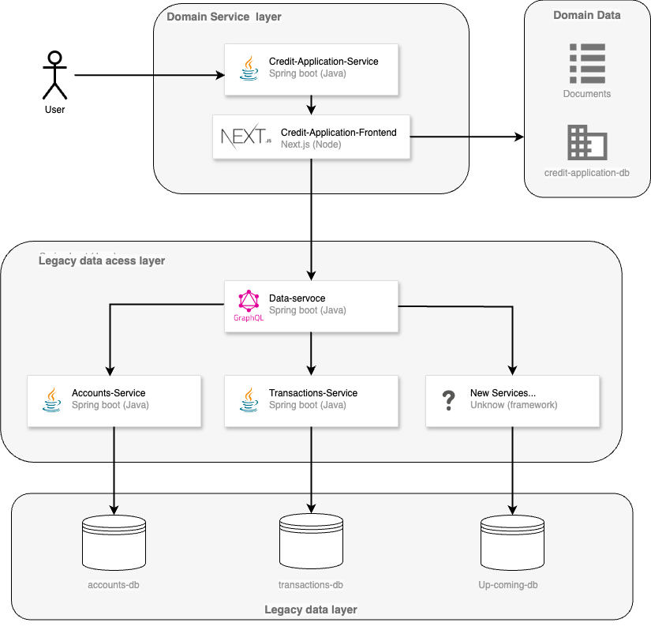

# Core-Banking (Java)

This project is a core banking system with a microservices architecture. It includes frontend and backend services, as well as legacy data access services. The frontend is built with Next.js, while the backend services and legacy data access services are built with Spring Boot. The data aggregation service is implemented using GraphQL.

</a>

## Table of Contents

1. [Project Structure](#project-structure)
2. [Technologies Used](#technologies-used)
3. [Setup Instructions](#setup-instructions)
    - [Frontend Service](#frontend-service)
    - [Domain Service](#domain-service)
    - [Data Service](#data-service)
    - [Legacy Data Access Services](#legacy-data-access-services)
    - [Databases](#databases)
4. [Running the Project](#running-the-project)
5. [Architecture Overview](#architecture-overview)
6. [Contributing](#contributing)
7. [License](#license)

## Project Structure

\`\`\`
core-banking/  
├── core-banking-frontend/  
├── core-banking-service/  
├── data-service/  s
├── accounts-service/  
├── transactions-service/  
├── docker-compose.yml  
├── README.md  
\`\`\`

## Technologies Used

- Frontend: Next.js
- Backend: Spring Boot (Java)
- Data Aggregation: GraphQLs
- Databases: MySQL (or any other RDBMS)
- Containerization: Docker, Docker Compose

## Setup Instructions

### Prerequisites

- Node.js and npm (for frontend)
- Java 11+ and Maven (for backend services)
- Docker and Docker Compose
- MySQL (or any RDBMS of your choice)

### Frontend Service

1. Navigate to the frontend directory:
    \`\`\`bash
    cd core-banking-frontend
    \`\`\`

2. Install the dependencies:
    \`\`\`bash
    npm install
    \`\`\`

3. Start the development server:
    \`\`\`bash
    npm run dev
    \`\`\`

### Domain Service

1. Navigate to the backend directory:
    \`\`\`bash
    cd core-banking-service
    \`\`\`

2. Build the project using Maven:
    \`\`\`bash
    mvn clean install
    \`\`\`

3. Run the Spring Boot application:
    \`\`\`bash
    mvn spring-boot:run
    \`\`\`

### Data Service

1. Navigate to the data service directory:
    \`\`\`bash
    cd data-service
    \`\`\`

2. Build the project using Maven:
    \`\`\`bash
    mvn clean install
    \`\`\`

3. Run the Spring Boot application:
    \`\`\`bash
    mvn spring-boot:run
    \`\`\`

### Legacy Data Access Services

1. For accounts-service and transactions-service, follow similar steps as the domain service:

    \`\`\`bash
    # Navigate to the service directory
    cd accounts-service
    # or
    cd transactions-service

    # Build the project using Maven
    mvn clean install

    # Run the Spring Boot application
    mvn spring-boot:run
    \`\`\`

### Databases

1. Ensure MySQL is installed and running.
2. Create the necessary databases:
    \`\`\`sql
    CREATE DATABASE core_banking_db;
    CREATE DATABASE accounts_db;
    CREATE DATABASE transactions_db;
    \`\`\`

## Running the Project

1. Use Docker Compose to start all services:
    \`\`\`bash
    docker-compose up
    \`\`\`

2. Access the frontend application at: `http://localhost:3000`
3. Access the backend services at their respective ports as defined in `docker-compose.yml`.

## Architecture Overview

1. **Frontend Layer**:
   - **Technology**: Next.js
   - **Responsibility**: User Interface for interacting with the core banking system.
   - **Interaction**: Makes API calls to `core-banking-service`.

2. **Domain Services Layer**:
   - **Technology**: Java (Spring Boot)
   - **Components**: `core-banking-service`
   - **Responsibility**: Handles business logic for banking operations.
   - **Interaction**: Connects to `core_banking_db`.

3. **Data Service Layer**:
   - **Technology**: GraphQL
   - **Components**: `data-service`
   - **Responsibility**: Aggregates data from legacy data access services.
   - **Interaction**: Queries `accounts-service` and `transactions-service`.

4. **Legacy Data Access Layer**:
   - **Technology**: Java (Spring Boot)
   - **Components**: `accounts-service`, `transactions-service`
   - **Responsibility**: Provides access to legacy data stored in `accounts_db` and `transactions_db`.

5. **Data Layer**:
   - **Components**: `core_banking_db`, `accounts_db`, `transactions_db`
   - **Responsibility**: Store data for banking operations, accounts, and transactions.

## Contributing

Contributions are welcome! Please fork this repository and submit a pull request for any changes you'd like to make.

## License

This project is licensed under the MIT License - see the [LICENSE](LICENSE) file for details.
